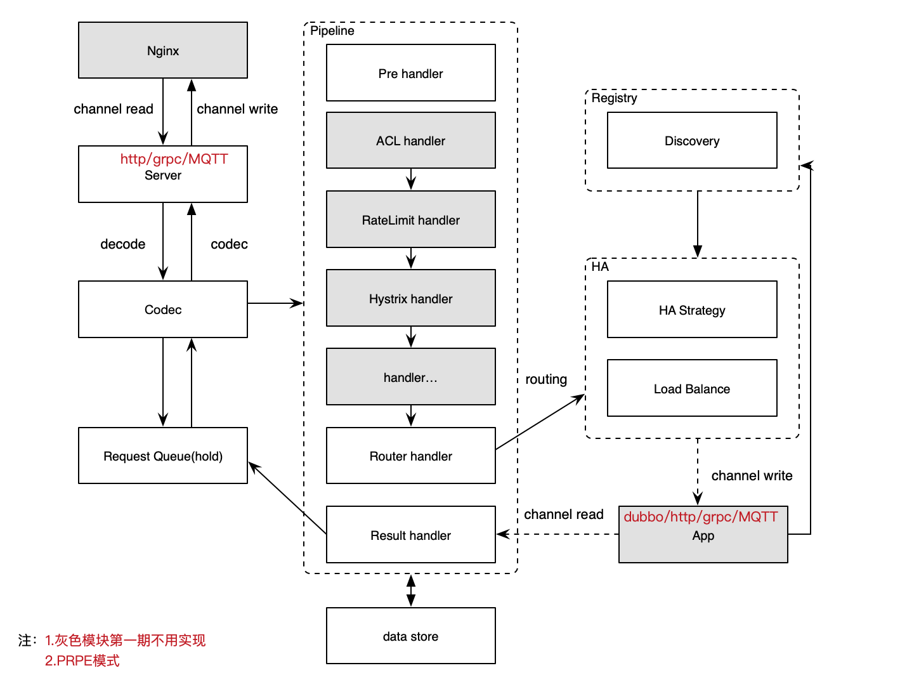

# asyc-gateway
async api gateway

# 1.async
首先解释一下这里async并非io模型中的异步，而是非阻塞语义。
async-gateway初衷为了解决dubbo-2.6一下的泛化调用同步阻塞问题，解放invoke当前线程，
而不是如BIO一样阻塞等待数据到来，通过类似Selector事件驱动机制，dubbo provider往channel写回数据后，告知等待的
入口channel（http request）数据准备就绪，然后writeAndFlush。

# 2.线程模型
async-gateway是基于netty的reactor线程模型，
- 事件分发器单线程选择就绪事件；
- IO线程负责读、解码、编码、写等纯cpu事件；
- 业务线程负责往service provider（dubbo）的channel写数据；    

这样实现了不同的线程/线程池处理不同事件，也就是io密集型和cpu密集型任务精准拆分，最大限度的利用cpu。
同时service provider回写数据，采用mpsc队列传输，传播写事件给IO线程；  
对于接入的channel超时问题，采用Hash-Wheel Timer时间轮对入口channel进行分片，这样每个步长的channel扫描超时数据达到精准调度，
而不是while(true)对全量数据扫描超时问题。

# 3.整体设计
参考zuul2 PRPE模型，对于扩展功能采用责任链模式

# 4.优化点
1.熔断限流  
2.入口多协议支持  
3.内部服务多协议支持  

# 5.组织
Gulf-University

